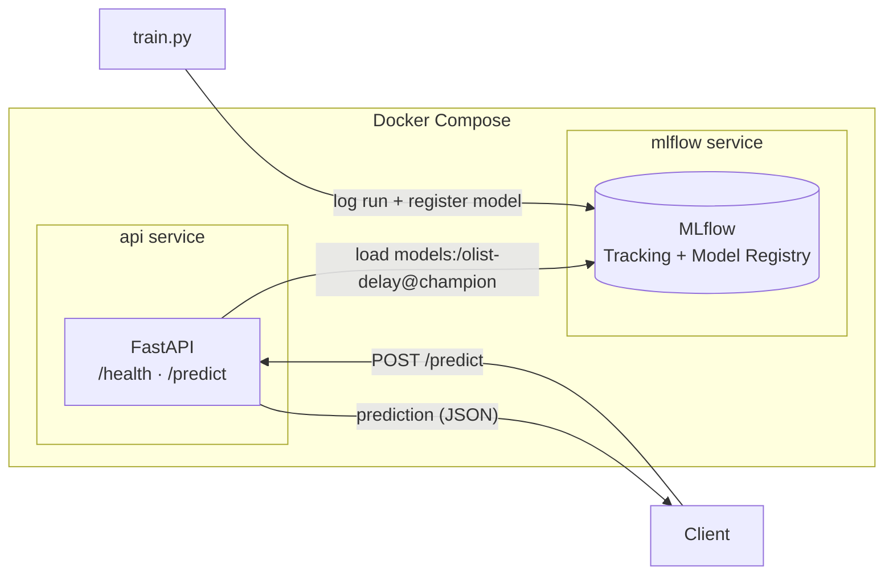

# Olist Delivery-Delay — MLOps Pipeline

[](https://github.com/jpafcampos/olist-mlops/actions/workflows/ci.yml)

An end-to-end MLOps project built around the [Olist Brazilian e-commerce dataset](https://www.kaggle.com/olistbr/brazilian-ecommerce). It trains a model, versions it in a model registry, and serves it through a containerized API.

The goal is to demonstrate the **operational loop around a model** (train → version → promote → serve → test → ship).


## Architecture

Two decoupled pipelines share a single MLflow instance as the source of truth: an **offline training pipeline** that logs and registers versioned models, and an **online serving pipeline**: a FastAPI service that loads the promoted model from the registry over HTTP. Both run as Docker Compose services on a shared network.



## Tech stack

| Concern | Tool |
| --- | --- |
| Experiment tracking & model registry | MLflow |
| Model serving (REST API) | FastAPI + Uvicorn |
| Model | scikit-learn (served via MLflow `pyfunc`) |
| Containerization & orchestration | Docker + Docker Compose |
| Continuous integration | GitHub Actions + pytest |

## Getting started

### Prerequisites

- Docker and Docker Compose
- Python 3.11 (for training and running tests locally)

### First-time setup (populate the registry)

The MLflow registry starts empty, so you first train a model and promote it.

```bash
# 1. start the MLflow service
docker compose up mlflow -d

# 2. create a local environment
python3.11 -m venv .venv
source .venv/bin/activate
pip install -r requirements-dev.txt

# 3. train a baseline (logs + registers the model in MLflow)
MLFLOW_TRACKING_URI=http://127.0.0.1:5000 python src/olist/train.py

# 4. promote version 1 to the "champion" alias the API serves
MLFLOW_TRACKING_URI=http://127.0.0.1:5000 \
  python -c "from mlflow import MlflowClient; MlflowClient().set_registered_model_alias('olist-delay','champion',1)"
```

### Run

```bash
docker compose up --build
```

- API docs (Swagger): <http://127.0.0.1:8000/docs>
- MLflow UI: <http://127.0.0.1:5000>

Example request:

```bash
curl -X POST http://127.0.0.1:8000/predict \
  -H "Content-Type: application/json" \
  -d '{"features": [0.5, -1.2, 0.3]}'
# -> {"prediction": 1, "label": "late"}
```

### Tests

```bash
PYTHONPATH=src pytest
```

## Project structure

```
olist-mlops/
├── .github/workflows/ci.yml   # CI: install deps + run tests on every push
├── src/olist/
│   ├── api.py                 # FastAPI app; loads model at startup (lifespan)
│   ├── train.py               # trains baseline, logs & registers to MLflow
│   └── features.py            # shared feature transforms (Step 3)
├── tests/test_api.py          # smoke test on /health
├── Dockerfile                 # API image (code only)
├── docker-compose.yml         # api + mlflow services
├── requirements.txt           # runtime deps
└── requirements-dev.txt       # runtime + test/lint deps
```

## Design decisions

- **The registry is a service, not a file baked into the image.** The API image contains only code; it fetches the model from the MLflow service over HTTP (`--serve-artifacts`). This keeps the image small and lets the model be updated independently of the app.
- **The model is loaded at startup, not at import.** Loading happens in FastAPI's `lifespan` handler, so importing the app has no side effects — the app stays testable and CI can import it without a live registry.
- **Alias-based promotion.** The API serves `models:/olist-delay@champion` — a movable label — instead of a hardcoded version. Promoting a new model is just remapping the alias; the serving code never changes.
- **Framework-agnostic serving.** The model is loaded through MLflow's `pyfunc` interface, so swapping scikit-learn for another framework wouldn't touch the API.
- **Environment-driven config.** `MLFLOW_TRACKING_URI` selects the registry, so the same code runs locally and inside Compose, where services address each other by name.
- **CI as a smoke test.** Every push runs a dependency-free `/health` test — a cheap gate that catches broken imports and missing dependencies early.

## Roadmap

- [x] **Step 1 — Operational skeleton:** train → MLflow registry → FastAPI serving → Docker Compose → CI.
- [ ] **Step 2 — Real features:** load the Olist dataset (DuckDB/dbt) and train a leak-free delivery-delay model using order-time features only.
- [ ] **Step 3 — Train/serving consistency:** a single feature-transform module imported by both training and the API.
- [ ] **Step 4 — Orchestration:** wire the training pipeline as a Dagster DAG.
- [ ] **Step 5 — Monitoring:** prediction logging + drift reports (Evidently) + a retraining trigger.
- [ ] **Step 6 — LLM surface (AI Engineering):** an `/analyze-review` endpoint turning review text into structured JSON, with evals and cost/latency tracking (LLMOps).
- [ ] **Step 7 — Cloud:** deploy to a managed warehouse (Snowflake/Databricks) and a managed container service.

## Author

João Pedro Campos
